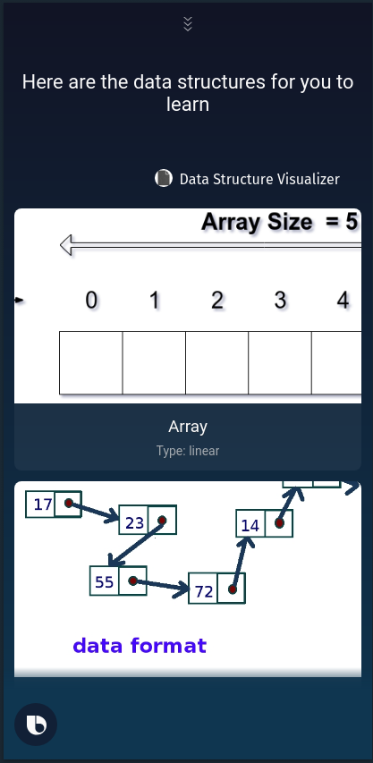
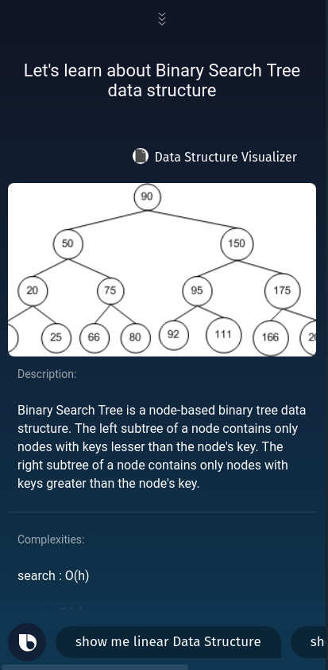
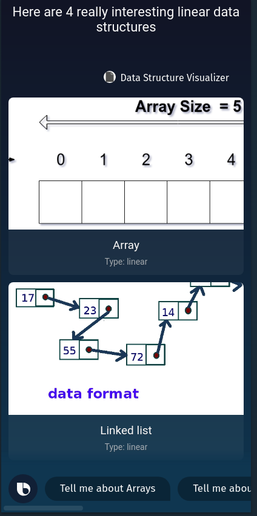

# Bixby Capsule DataStructure Visualizer

## 🤔 What's Data Structure Visualizer?
It's a Bixby Capsule 🤖 that gives you information about data structures.

## 📱  Screenshots:

### List of all Data Structures:

### About Binary Search Tree:

### About Linear Data Structures:

## ❤️ Credits:
All the amazing guys at [Samsung](https://www.samsung.com/us/) and [Viv Labs](http://viv.ai/).
